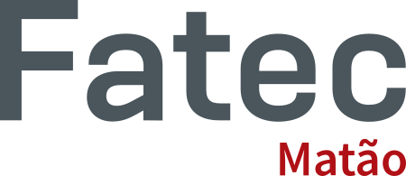

# Fatec Matão

### About
Fatec Matão's website is a non-profit project, developed by Fatec Taquaritinga students, during the Integrator Project II class.

### Technologies
- HTML 5
- Bootstrap 4.6
- Vue.js 2
- Nuxt.js 2

### Integrations
- **BootstrapVue**: With BootstrapVue you can build responsive, mobile-first, and ARIA accessible projects on the web using Vue.js and the world's most popular front-end CSS library. (https://bootstrap-vue.org/)

### Team
- Maria Gandini
- Mariana Lourenço
- Ryan Oliveira
- Vinicius Ricci

### License
© Fatec Matão 2021 - Licensed in [MIT License](https://github.com/RyanMatheuZ/petit-glace/blob/main/LICENSE).
